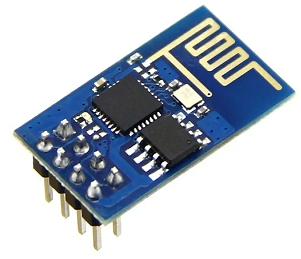

# examples-esp8266

This repository contains source code of Embedded Control Programs (as Examples) for MCU ESP8266.

## ESP8266

(WiFi-UART Transceiver)

**Hardware Platform**

- ESP-01 Ai-Thinker

**Software Platform**
  
- Embedded SDK (firmware)
  - ai-thinker-0.9.5.2-115200.bin
     - AT (AT-commands)
     - UART0.baudrate: 115200
     - flash start address: 0x00000

- Language
  - AT-commands
  - Python (client side)

## Rersources

- [Tools](https://drive.google.com/drive/folders/1uRlADZyCAepFLwLm_BQ_auAUabZPL0NA)
  - flash-download-tool-3.9.5
  - firmwares
  - esptool
  - esp8266-flasher
